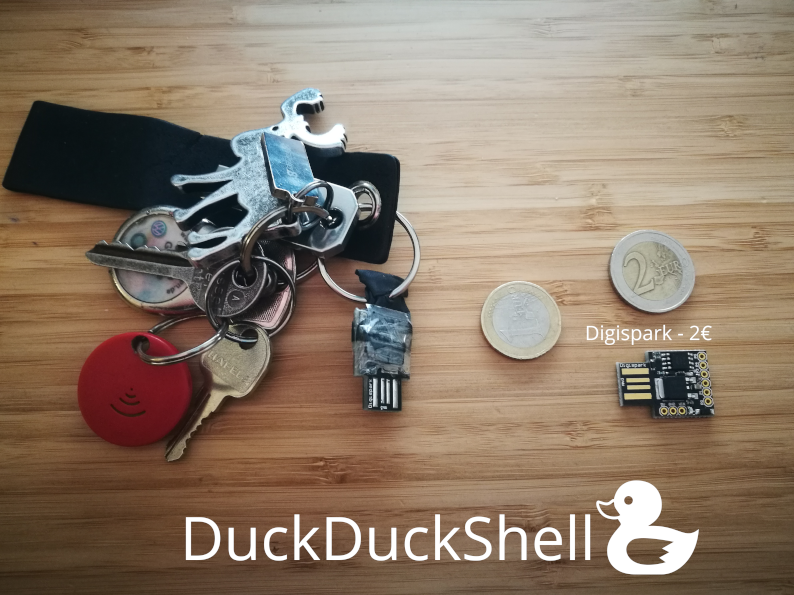

#DuckDuckShell

{:width="600"}

You can build a cheap keystroke injection stick with the digispark for less than 2€.
I work with embedded devices and I often need to setup a testing enviroment I need to get
remote access to. This stick is setting up a reverse shell in less than 10 seconds. 

Please only use it on devices you personally own or have permission to have access!


# Installation

I dont like the Arduino IDE and its toolchain. In this project Im using platformio which
is a open source IoT build-ecosystem for embedded devices. If you are interested in learning more
about platformio go to [https://platformio.org](https://platformio.org). 

You can install platformio via:

```
$ pip install -U platformio

```

Thats it! Everything else is handled via platformio based on the "platformio.ini" file in the repository.


# Compilation and Flash

Keep the digispark unplugged and run: 

```
$ pio run -t upload
```

It will download all needed libraries and frameworks and compile the project. After successful compilation it will ask you to plug in the digispark. Plug it in, and done!


# Reverse shell setup

You need to have a machine listenting for incomming connections like:
 
```
$ nc -nvlp 8000
```

This will listen for incomming conncetions on port 8000, as also used in the sample code provided. .
This is handy in case you are on the same network.  Im using it in combination with [Platypus]("https://github.com/WangYihang/Platypus") to manage my reverse shell connections. 


#ToDo
- [ ] Add reverse shell cheat sheet
- [ ] Integrate duck build script into submodules and platformio build
- [ ] Integrate a parameter file for easy port and ip/url settings


